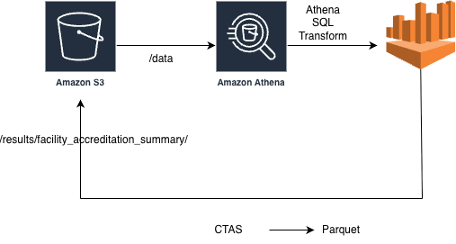

# healthcare-facility-data-pipeline
This project implements Stage 1 of a healthcare data engineering pipeline.
The goal is to ingest facility JSON data into Amazon S3, query it using Amazon Athena, and produce a clean, analytics-ready Parquet dataset containing:

* facility_id

* facility_name

* employee_count

* number_of_offered_services

* expiry_date_of_first_accreditation (earliest accreditation valid_until date)

The final dataset is written to S3 as Parquet


## S3 Directory Structure
```
medlaunch-data-pipeline-bucket/
│
├── data/
│     └── facilities.jsonl         <-- raw NDJSON input (one JSON per line)
│
└── results/
      └── facility_accreditation_summary/
             └── part-0000.parquet  <-- Athena CTAS output



```
## 1. Input Data Preparation
provided the JSON inside a .docx file, which cannot be read by Athena.
Therefore, the JSON was extracted and converted into NDJSON format (newline-delimited JSON), required by Athena’s JSON SerDe.

Uploaded JSON file to S3
aws s3 cp facilities.jsonl s3://medlaunch-data-pipeline-bucket/data/


## 2. Create Athena Database

CREATE DATABASE IF NOT EXISTS healthcare_facility_db;

## 3. Create Athena External Table for Raw JSON
CREATE EXTERNAL TABLE IF NOT EXISTS healthcare_facility_db.facilities_raw (
  facility_id   string,
  facility_name string,
  location      struct<
                   address:string,
                   city:string,
                   state:string,
                   zip:string
                 >,
  employee_count int,
  services       array<string>,
  labs           array<
                   struct<
                     lab_name:string,
                     certifications:array<string>
                   >
                 >,
  accreditations array<
                   struct<
                     accreditation_body:string,
                     accreditation_id:string,
                     valid_until:string
                   >
                 >
)
ROW FORMAT SERDE 'org.openx.data.jsonserde.JsonSerDe'
WITH SERDEPROPERTIES (
  'ignore.malformed.json' = 'true'
)
LOCATION 's3://medlaunch-data-pipeline-bucket/data/'
TBLPROPERTIES ('has_encrypted_data'='false');


## 4. Validate the Data Load

Confirm rows are visible in Athena:
SELECT * 
FROM healthcare_facility_db.facilities_raw
LIMIT 5;


## 5. Stage-1 Transformation Query

Calculate:

* number of services offered

* earliest accreditation expiry date

SELECT
  f.facility_id,
  f.facility_name,
  f.employee_count,
  cardinality(f.services) AS number_of_offered_services,
  MIN(CAST(a.valid_until AS date)) AS expiry_date_of_first_accreditation
FROM
  healthcare_facility_db.facilities_raw AS f
CROSS JOIN UNNEST(f.accreditations) AS t(a)
GROUP BY
  f.facility_id,
  f.facility_name,
  f.employee_count,
  cardinality(f.services)
ORDER BY
  f.facility_id;


## 6. Create Final Parquet Output Table (CTAS)
CREATE TABLE healthcare_facility_db.facility_accreditation_summary
WITH (
  format = 'PARQUET',
  external_location = 's3://medlaunch-data-pipeline-bucket/results/facility_accreditation_summary/'
) AS
SELECT
  f.facility_id,
  f.facility_name,
  f.employee_count,
  cardinality(f.services) AS number_of_offered_services,
  MIN(CAST(a.valid_until AS date)) AS expiry_date_of_first_accreditation
FROM
  healthcare_facility_db.facilities_raw AS f
CROSS JOIN UNNEST(f.accreditations) AS t(a)
GROUP BY
  f.facility_id,
  f.facility_name,
  f.employee_count,
  cardinality(f.services)
ORDER BY
  f.facility_id;


Query the final table:
SELECT *
FROM healthcare_facility_db.facility_accreditation_summary;


## 7. Final Outcome
After completing the above steps:

* Raw JSON is stored in S3 /data

* Athena external table reads the JSON

SQL transformation computes:
    number of services offered
    earliest accreditation expiry

CTAS writes analytics-ready Parquet to:

s3://medlaunch-data-pipeline-bucket/results/facility_accreditation_summary/


This completes Stage 1 of the data engineering project.


